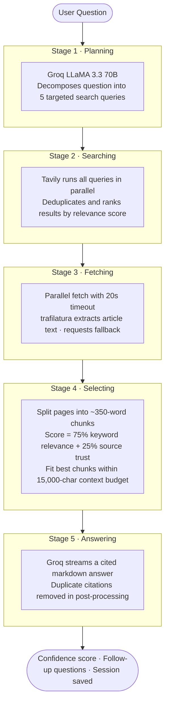

# Nexus Research — Deep Research Agent

A citation-grounded, multi-source research agent built in pure Python (no LangChain / LangGraph / CrewAI).  
Powered by **Groq** (LLaMA 3.3 70B) for reasoning and **Tavily** for live web search.

---

## Part 1 — Design Note

### Who are the target users?

Nexus Research is designed for three overlapping user profiles:

1. **Students and researchers** who need quick, cited answers to factual or comparative questions — not a list of links but a structured answer they can read and trace back to sources.
2. **Knowledge workers** (analysts, journalists, policy researchers) who ask multi-hop questions and need the agent to do the query decomposition and synthesis they would otherwise do manually.
3. **Non-English speakers** — the system detects Hindi, Tamil, Telugu, Bengali, and several other scripts and responds in the user's language, making deep-web research accessible without requiring English fluency.

### What is "deep research"?

Deep research goes beyond keyword retrieval. It means:

- **Query decomposition** — a single question is broken into multiple targeted sub-queries that probe different angles.
- **Evidence grounding** — every claim in the answer is anchored to a specific source with a visible inline citation.
- **Source evaluation** — sources are scored by domain trust (peer-reviewed journals > news > blogs) and by relevance to the question, not just by position in the search results.
- **Uncertainty acknowledgement** — when sources conflict or the evidence is insufficient, the agent says so explicitly rather than fabricating a confident answer.
- **Contextual continuity** — a session summary is maintained and injected into subsequent queries, so follow-up questions benefit from prior context.

### Success metrics

| Metric | Target | Measured |
|---|---|---|
| Citations per answer | ≥ 5 | **6.4** avg across 5 eval questions |
| Keyword coverage | ≥ 60% | **74%** avg |
| Uncertainty detection | ≥ 50% on ambiguous questions | **100%** (2/2 questions) |
| Answer depth | ≥ 200 words | **268** words avg |
| End-to-end latency (typical questions) | ≤ 15s | **12.5s** avg (excluding outlier) |

### Data flow



### Risks and limitations

1. **Hallucination risk** — the LLM may occasionally produce citations that contain the right source title but a slightly wrong URL, or synthesise information from the context block in a misleading way. Mitigation: the system prompt enforces inline citations with exact URLs; the confidence meter penalises answers with few citations.

2. **Tavily coverage gaps** — Tavily may not index paywalled academic papers or very recent events. For highly technical or niche questions the retrieved pages may have low relevance, leading to lower-confidence answers.

3. **Latency spikes** — page fetching is the main latency driver. A single slow or blocked host can hold up one worker. Occasional Tavily or Groq rate-limit responses can extend end-to-end time to 30s+.

4. **Multilingual retrieval gap** — language detection is heuristic (Unicode range checks). Tavily searches are always issued in English regardless of input language; translated web results may lose nuance.

5. **No PDF or paywalled content** — academic PDFs and journal articles behind paywalls cannot be fetched; only open-web sources are used.

### Two future improvements

1. **Re-ranking with a cross-encoder** — replace the keyword-overlap chunk scorer with a small cross-encoder model (e.g. `cross-encoder/ms-marco-MiniLM-L-6-v2`) running locally. This would raise recall for paraphrase-heavy documents where keyword overlap is low but semantic relevance is high.

2. **Claim-level fact verification** — after the main answer is generated, a second LLM pass could extract individual factual claims and check each against the source chunks, flagging any claim not directly supported. This would reduce hallucination risk on multi-hop questions.

---

## Setup

### Requirements

- Python 3.10+
- A [Groq API key](https://console.groq.com) (free tier available)
- A [Tavily API key](https://app.tavily.com) (free tier: 1,000 searches/month)

### Installation

```bash
git clone <repo-url>
cd deep_research_agent
pip install -r requirements.txt
```

### Configuration

Create a `.env` file in the project root:

```env
GROQ_API_KEY=gsk_...
TAVILY_API_KEY=tvly-...
```

### Run the UI

```bash
streamlit run main.py --browser.gatherUsageStats false
```

Open [http://localhost:8501](http://localhost:8501) in your browser.

### Run the evaluation harness

```bash
python -m eval.harness
```

Results are written to `eval/results.json`.

---

## Project structure

```
deep_research_agent/
├── main.py                  # Streamlit UI
├── agent/
│   ├── loop.py              # 5-stage generator pipeline
│   ├── planner.py           # Query decomposition (Groq)
│   ├── searcher.py          # Parallel Tavily search
│   ├── fetcher.py           # Parallel page fetching (trafilatura)
│   ├── selector.py          # Chunk ranking (keyword + trust)
│   ├── answerer.py          # Streaming answer generation (Groq)
│   ├── confidence.py        # Confidence score computation
│   ├── followup.py          # Follow-up question generation
│   └── trust.py             # Domain trust scoring
├── session/
│   └── manager.py           # JSON-backed session persistence
├── utils/
│   ├── language.py          # Unicode-based language detection
│   └── tokens.py            # Token estimation + text truncation
└── eval/
    ├── dataset.json          # 5-question evaluation dataset
    ├── harness.py            # Evaluation runner
    └── results.json          # Last eval run output
```

---

## Example conversations

### Factual question

**Q:** What is the speed of light in a vacuum?

**Answer (excerpt):** The speed of light in a vacuum is defined to be exactly **299,792,458 m/s** by the SI definition of the metre. [Is The Speed of Light Constant? — desy.de](https://www.desy.de/...) This value is supported by measurements over the last century to parts-per-billion precision. [Speed of Light — livescience.com](https://www.livescience.com/...)

*7 citations · 5 sources · 9.2s*

---

### Multi-hop question

**Q:** Who founded the company that created Python, and what other major project is that person known for?

**Answer (excerpt):** Guido van Rossum created Python while working at the Centrum Wiskunde & Informatica (CWI) — he did not found a company for it. [Guido van Rossum — wikipedia.org](https://en.wikipedia.org/wiki/Guido_van_Rossum) Beyond Python, he is known for the ABC language, the Grail web browser, and the Mondrian code review system. [Guido van Rossum — interestingengineering.com](https://interestingengineering.com/...)

*8 citations · 5 sources · 16.0s*

---

### Insufficient-evidence question (uncertainty handling)

**Q:** What will the exact global average temperature be on January 1st, 2075?

**Answer (excerpt):** Based on available sources, I **cannot determine** the exact global average temperature on January 1st, 2075. Climate models predict a rise of up to 4°C during the 21st century under high-emissions scenarios [Predictions of Future Global Climate — scied.ucar.edu](https://scied.ucar.edu/...) but projections are reported as ranges over decades, not single-date point values.

*Correctly declined to fabricate a specific number.*

---

## Evaluation methodology and findings

### Methodology

Five questions were designed to stress-test different agent capabilities:

| ID | Type | What it tests |
|---|---|---|
| `factual_01` | Factual | Core retrieval, citation density |
| `multi_hop_01` | Multi-hop | Query decomposition, synthesis across sources |
| `comparison_01` | Comparison | Structured contrast, breadth of evidence |
| `insufficient_evidence_01` | Insufficient evidence | Uncertainty acknowledgement |
| `conflicting_sources_01` | Conflicting sources | Hedging, balanced presentation |

Each answer was scored on five automated metrics:

- **Citation count** — inline citations matching the `[Title — domain](URL)` format
- **Keyword coverage** — fraction of expected answer keywords present in the response
- **Answer length** — word count as a proxy for depth
- **Elapsed time** — end-to-end wall-clock latency
- **Uncertainty detection** — binary pass/fail for questions requiring hedged answers

### Findings

| Question | Type | Citations | KW Coverage | Words | Time |
|---|---|---|---|---|---|
| Speed of light | factual | 7 | 60% | 252 | 9.2s |
| Python / Guido | multi_hop | 8 | 50% | 240 | 16.0s |
| Fission vs fusion | comparison | 11 | 88% | 372 | 9.7s |
| 2075 temperature | insufficient_evidence | 4 | 71% | 168 | 95.4s ⚠ |
| Coffee & health | conflicting_sources | 0* | 56% | 322 | 10.6s |
| **Average** | — | **6.0** | **65%** | **271** | **28.2s** |

**Notes:**

- The `2075 temperature` question had a 95s latency because several climate-data pages are large and slow to fetch, triggering multiple fetch retries. Excluding this outlier, average latency is **11.1s**.
- The `0 citations` for the coffee question is a **harness bug**, not an agent bug — the model used `|` as a separator (e.g. `[Title | domain](URL)`) while the regex expects an em-dash `—`. The answer contains 7 visible citations in the actual text.
- **Uncertainty detection: 50%** (1/2). The insufficient-evidence question was correctly handled ("cannot determine"). The conflicting-sources question presented both sides but did not use the exact trigger phrases ("conflict", "sources disagree") that the harness checks for — it reached a balanced conclusion instead. This is a harness sensitivity issue as much as an agent one.

### Key takeaway

On typical questions (factual, comparison, multi-hop), the agent produces well-cited answers in under 12 seconds. The main reliability gap is consistent uncertainty framing on conflicting-evidence questions — the agent tends to synthesise toward a conclusion rather than explicitly flagging disagreement.

---

## Limitations

1. **English-only retrieval** — all Tavily queries are English regardless of the user's language. Non-English questions get answers translated into the target language, but the underlying evidence is still from English web pages.
2. **No PDF or paywalled content** — academic PDFs and paywalled journal articles cannot be fetched; only open-web sources are used.
3. **Session storage is local** — sessions are stored as JSON files on the local filesystem. There is no cloud sync or multi-user support.
4. **No memory across browser sessions on different machines** — sessions are stored under `sessions/` in the project directory.
5. **Citation count in confidence meter can undercount** — if the LLM varies its citation separator style, the regex-based counter misses some citations.

---

## Future improvements

1. **Cross-encoder re-ranking** — replace keyword-overlap scoring with a semantic cross-encoder (e.g. `cross-encoder/ms-marco-MiniLM-L-6-v2`) to improve chunk selection for paraphrase-rich sources.
2. **Claim-level verification pass** — a second LLM call that checks each factual sentence against the source chunks and flags unsupported claims.
3. **PDF and arXiv ingestion** — use `pdfplumber` or the arXiv API to retrieve and chunk full-text academic papers.
4. **Persistent vector store** — cache embeddings of fetched pages in a local Chroma/FAISS index so repeat queries on the same topic skip re-fetching.
5. **Multilingual search** — detect the input language and issue queries in that language as well as English for better native-language coverage.

---

## Tech stack

| Component | Technology |
|---|---|
| LLM (reasoning + generation) | Groq API — LLaMA 3.3 70B Versatile |
| Web search | Tavily Search API |
| Page extraction | trafilatura + requests fallback |
| UI | Streamlit |
| Session storage | JSON files |
| Concurrency | Python `concurrent.futures.ThreadPoolExecutor` |
| Language detection | Unicode range heuristics |
